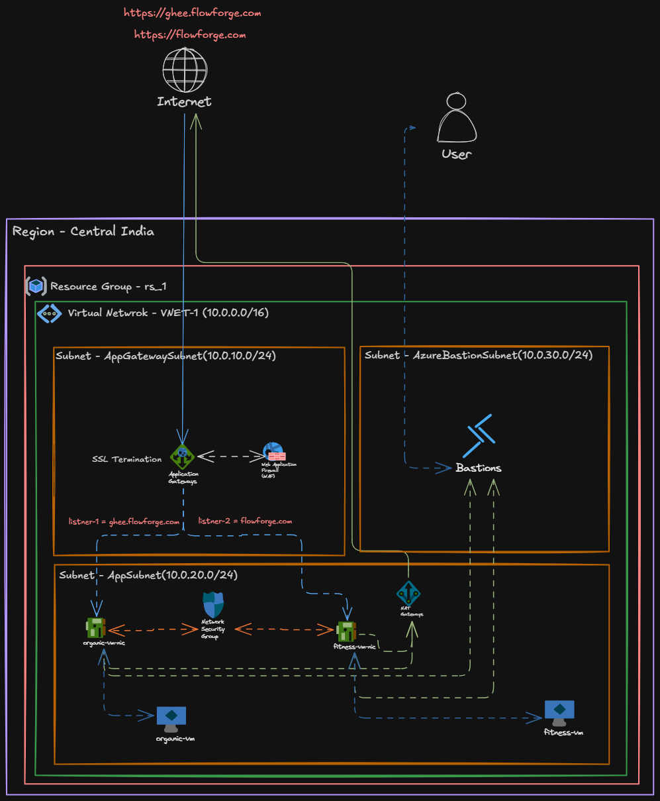

# Application-Gateway (Domain-Based Routing)

Implementation of Application Gateway and related Azure infrastructure using Terraform. Zero-direct-internet architecture with Layer-7 routing and Web Application Firewall.

## Architecture Diagram


## Infrastructure Components
- **Network**: Resource Group, VNet, App Gateway Subnet, Compute Subnet.
- **Compute**: 2 backend VMs (`Fitness`, `Ghee`) without public IPs.
- **Gateway**: Azure Application Gateway (WAF_v2) for SSL termination and L7 routing.
- **Security**: Web Application Firewall (WAF) integrated with App Gateway.

## Environment Management
- **Workspaces**: Independent root modules in `env/dev/` and `env/prod/`.
- **Modularity**: Shared modules in `modules/` (`network`, `compute`, `gateway`).
- **Variable Passing**: Environment-specific inputs via `terraform.tfvars`. 
- **Secrets Management**: Sensitive values (passwords, certificates) injected via `.tfvars` file per environment.

## Repository Structure
```text
App-Gateway-TerraForm/
├── Architecture.png             
├── README.md                   
├── env/                         # Enviornments
│   ├── dev/                     # Development environment configurations
│   │   ├── main.tf              # Dev Env Execution File
│   │   ├── variables.tf         # Dev environment Variables
│   │   └── terraform.tfvars     # Value Passing 
│   └── prod/                    # Production Configurations
├── modules/                     # Terraform Modules
│   ├── compute/                 # Deploys private VMs and bootstraps web servers
│   ├── gateway/                 # Application Gateway layer-7 multi-site logic
│   └── network/                 # Sets up VNet, subnets, NSGs, NAT Gateway, Bastion
└── scripts/                   
    ├── appsetup.txt             # Bootstrap Scrip Fitness App
    └── setup.txt                # Bootstrap Scrip Ghee App
```

## Traffic Flow & Routing
- **Ingress**: TCP/443 (HTTPS) to App Gateway Public IP.
- **SSL Termination**: App Gateway decrypts HTTPS traffic using `.pfx` cert.
- **L7 Routing (Host-based)**: 
  - `flowforge.fun` → Fitness Backend Pool (Port 80)
  - `ghee.flowforge.fun` → Ghee Backend Pool (Port 80)
- **Egress**: VM responses routed back through App Gateway to the client.

## WAF Configuration
- **SKU**: WAF_v2
- **Mode**: Prevention (active blocking).
- **Ruleset**: OWASP 3.2 Managed Rule Set.
- **Limits**:
  - Request body check: Enabled
  - Max request body size: 128 KB
  - Max file upload: 100 MB

## Deployment Guide

### Prerequisites
- Azure CLI
- Terraform (~> 3.0)
- Certbot
- Azure Subscription
- DNS Domain Access

### 1. Generate SSL Certificates
```bash
certbot certonly --manual --preferred-challenges dns -d yourdomain.com -d sub.yourdomain.com
```

### 2. Convert to PFX
Azure App Gateway requires `.pfx` format:
```bash
openssl pkcs12 -export -out flowforge-ssl.pfx -inkey privkey.pem -in cert.pem -certfile chain.pem
```

### 3. Configure Target Environment
1. Copy `flowforge-ssl.pfx` to environment folder (e.g., `env/dev/`).
2. Update `env/dev/terraform.tfvars`:
```hcl
resource_group_name       = "target-rg"
location                  = "East US"
admin_username            = "admin"
admin_password            = "YourPassword!"
pfx_certificate_path      = "./flowforge-ssl.pfx" 
pfx_certificate_password  = "pfx-password"
```

### 4. Authenticate
```bash
az login
az account set --subscription "<SUBSCRIPTION_ID>"
```

### 5. Deploy
```bash
cd env/dev
terraform init
terraform plan
terraform apply -auto-approve
```

### 6. Post-Deployment (DNS)
- Map your domains to the Terraform output Application Gateway Public IP via A-records.