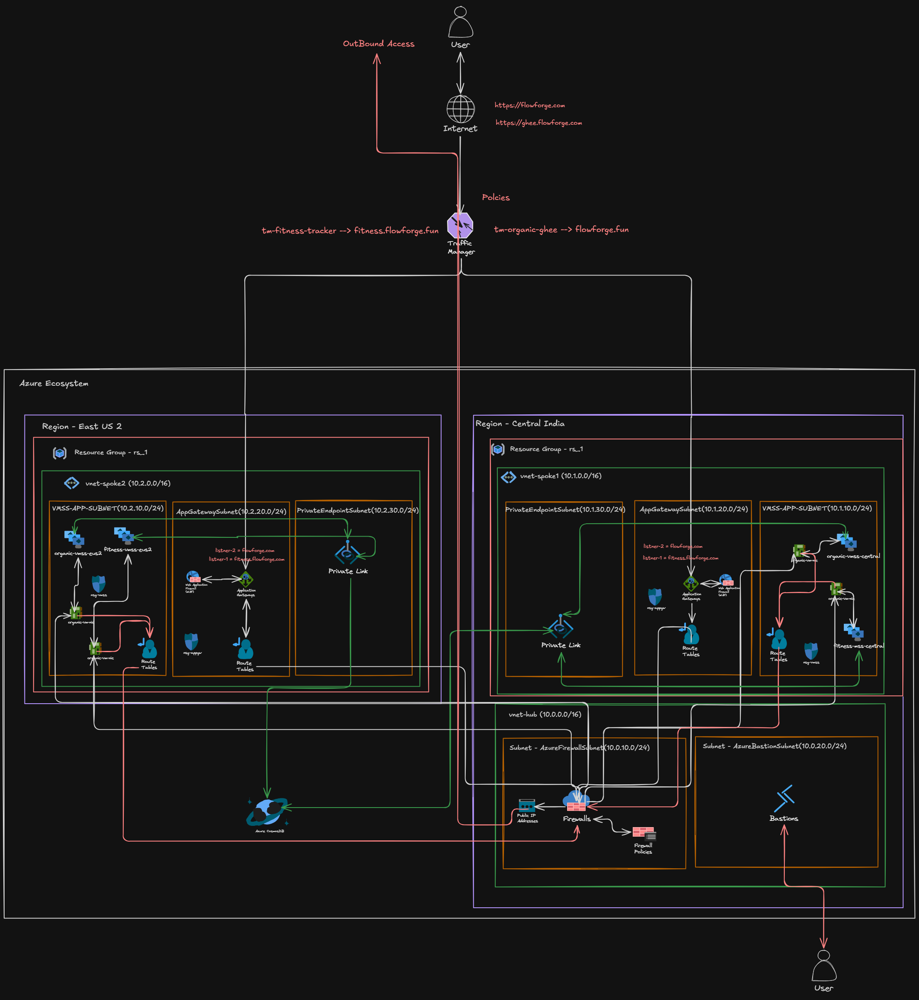

# Hub-and-Spoke Multi-Region Architecture

Implementation of an advanced Hub-and-Spoke multi-region Azure infrastructure using Terraform. Features global traffic routing, centralized firewall security, and automated scaling.

## Architecture Diagram


## Infrastructure Components
- **Network**: Hub VNet (Central India) peered with Spoke VNets (Central India, East US 2).
- **Compute**: Virtual Machine Scale Sets (VMSS) running `fitness` and `ghee` applications in both spoke regions.
- **Gateway & Routing**: 
  - Azure Traffic Manager for global DNS routing and high availability.
  - Application Gateways in each spoke for local Layer-7 routing.
- **Security**: Centralized Azure Firewall in the hub network for traffic inspection.
- **Database**: Azure Cosmos DB (MongoDB API) with private endpoints for secure access.

## Environment Management
- **Modularity**: Heavily modularized design with custom modules (`network_hub`, `network_spoke`, `security_rules`, `database`, `compute_vmss`, `gateway_app`).
- **Bootstrapping**: Custom template scripts (`bootstrap_ghee.sh.tftpl`, `bootstrap_fitness.sh.tftpl`) used to provision instances dynamically with database connection strings.

## Repository Structure
```text
Cloud-Project-1/
├── project-phase1.png           
├── main.tf                      # Core hub and spoke definitions
├── variables.tf                 
├── outputs.tf                   
├── modules/                     # Terraform Modules
│   ├── compute_vmss/            # VM Scale Sets
│   ├── database/                # Cosmos DB deployment
│   ├── gateway_app/             # Regional Application Gateways
│   ├── network_hub/             # Central Hub VNet & Firewall
│   ├── network_spoke/           # Spoke VNets and Peering
│   └── security_rules/          # Firewall rules and policies
└── scripts/                   
    ├── bootstrap_fitness.sh.tftpl
    └── bootstrap_ghee.sh.tftpl
```

## Traffic Flow & Routing
- **Global Routing**: Users hit Azure Traffic Manager endpoints.
- **Regional Ingress**: Traffic Manager routes traffic to the nearest/highest priority Application Gateway Public IP in the spokes.
- **L7 Routing**: Application Gateway routes traffic to the corresponding VMSS backend pools (`ghee` or `fitness`).
- **Database Access**: Backend services securely access Cosmos DB via Azure Private Endpoints.

## Deployment Guide

### Prerequisites
- Azure CLI
- Terraform (~> 3.0)
- Azure Subscription

### 1. Authenticate
```bash
az login
az account set --subscription "<SUBSCRIPTION_ID>"
```

### 2. Deploy
```bash
terraform init
terraform plan
terraform apply -auto-approve
```
