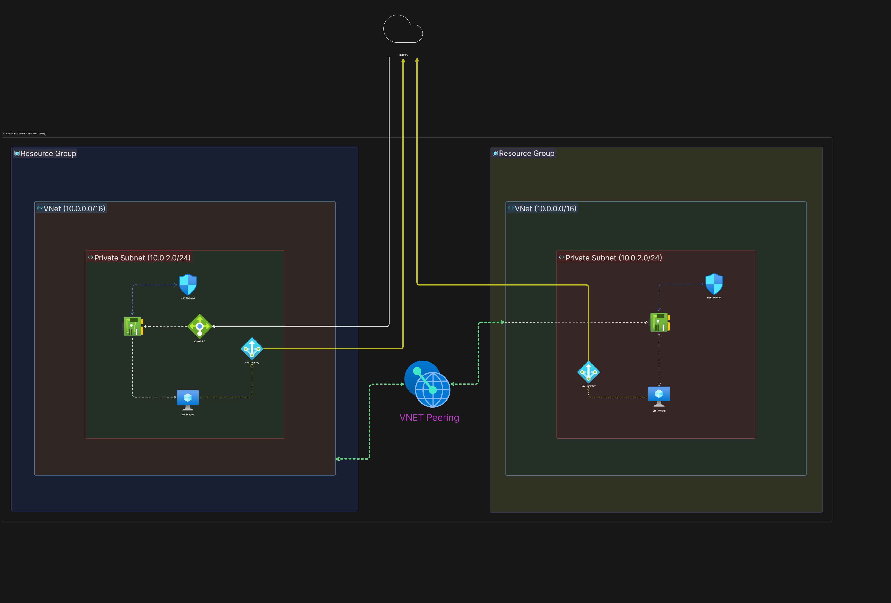

# Fitness Tracker (VNet Peering Architecture)

Implementation of a decoupled web-tier and database-tier architecture using Terraform. This architecture utilizes VNet Peering to connect two isolated Virtual Networks.

## Architecture Diagram


## Infrastructure Components
- **Network**: Two independent VNets (App VNet and DB VNet) linked via bidirectional VNet Peering.
- **Compute**: App Linux VM (Frontend) and DB Linux VM (Backend).
- **Outbound Connectivity**: Independent Azure NAT Gateways for both App and DB subnets.
- **Load Balancing**: Standard Azure Load Balancer distributing incoming traffic to the App VM frontend.
- **Security**: 
  - App NSG allowing HTTP and SSH.
  - DB NSG restricting inbound access strictly to MongoDB port (27017) from the App subnet.

## Repository Structure
```text
Fitness_tracker-Terraform/
├── Fitness-tracker-Architecture.png             
├── main.tf              # Main infrastructure resource definitions
├── variables.tf         # Configuration variables
├── output.tf            # Output variables (Load Balancer IPs, etc.)
├── providers.tf         
├── appsetup.txt         # Bootstrap script for App VM
└── dbsetup.txt          # Bootstrap script for DB VM
```

## Traffic Flow & Routing
- **Ingress**: External HTTP traffic arrives at the Azure Load Balancer Public IP.
- **Frontend**: The Load Balancer directs traffic to the App VM within the App Subnet.
- **Backend Access**: The App VM communicates with the Database VM over VNet Peering using the private IP (`10.1.1.5`) on port 27017.
- **Egress**: Outbound connections route through the respective NAT Gateways for each VNet.

## Deployment Guide

### Prerequisites
- Azure CLI
- Terraform (~> 3.0)
- Azure Subscription

### 1. Authenticate
```bash
az login
az account set --subscription "<SUBSCRIPTION_ID>"
```

### 2. Deploy
```bash
terraform init
terraform plan
terraform apply -auto-approve
```
