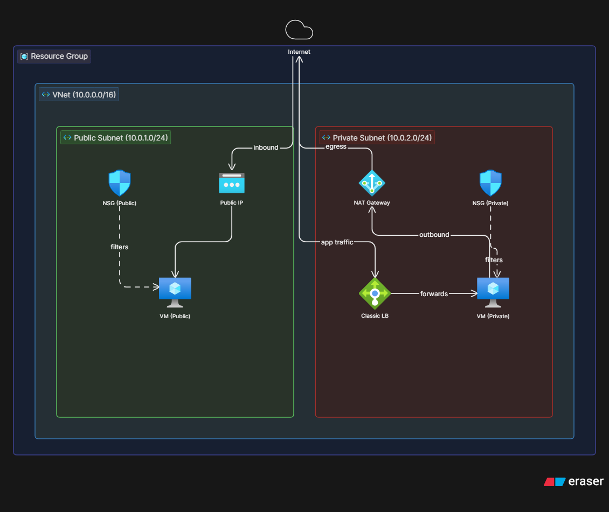

# Organic Ghee (Public & Private Subnets)

Implementation of an Azure infrastructure using Terraform that demonstrates subnet isolation. Features a web architecture partitioned into public and private tiers within a single Virtual Network.

## Architecture Diagram


## Infrastructure Components
- **Network**: Single Virtual Network (VNet) partitioned into a Public Subnet and a Private Subnet.
- **Compute**: Public VM (serving as a bastion/jumpbox) and a Private VM (hosting the application).
- **Outbound Connectivity**: Azure NAT Gateway attached exclusively to the Private Subnet for secure outbound internet access.
- **Load Balancing**: Standard Azure Load Balancer acting as the frontend ingress, targeting the Private VM pool.
- **Security**: 
  - Public NSG allowing HTTP and SSH from the internet.
  - Private NSG restricting access to HTTP and SSH specifically from the 10.0.1.0/24 (Public) subnet.

## Repository Structure
```text
Organic-Ghee-Terraform/
├── Organic_ghee-Architecture.png             
├── main.tf              # Core infrastructure definitions
├── variables.tf         # Variable mappings
├── output.tf            # Deployment outputs
├── providers.tf         
└── setup.txt            # Application bootstrap script
```

## Traffic Flow & Routing
- **Ingress**: Traffic hits the Standard Load Balancer's Public IP.
- **Load Balancing**: The Load Balancer routes traffic to the Private VM backend pool via port 80.
- **Management Access**: Administrators SSH into the Public VM, and then pivot (jump) into the Private VM.
- **Egress**: The Private VM uses the NAT Gateway to fetch updates securely without exposing a public IP.

## Deployment Guide

### Prerequisites
- Azure CLI
- Terraform (~> 3.0)
- Azure Subscription

### 1. Authenticate
```bash
az login
az account set --subscription "<SUBSCRIPTION_ID>"
```

### 2. Deploy
```bash
terraform init
terraform plan
terraform apply -auto-approve
```
